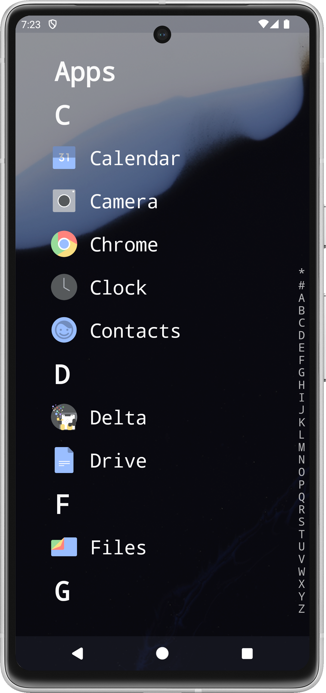

# Launchbox
Launchbox is a simple (read: slightly rubbish) launcher that I knocked together in a weekend.

## Features
* Alphabetical list with optional favourites section
* Adjustable light / dark theme
* Custom icon packs
* Font size adjustment
* Custom drop shadows
* Now Playing widget

## Contributing
Probably don't (for your own sake - I do not make Android apps often, as you may be able to tell).

## License

[MIT](https://choosealicense.com/licenses/mit/)